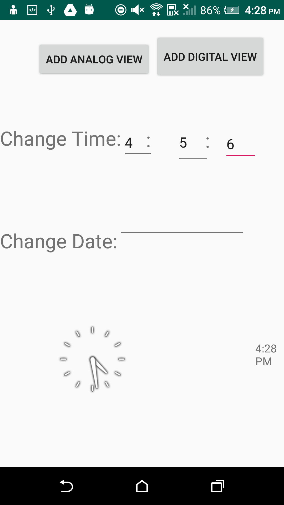

# ClockApplication_Android
Creates Digital and Analog clocks

The main features I was able to implement was the ability to change to an analog, or digital view. 
The project is not able to store the time or date. I experienced a lot of issues implementing these design patterns, 
as it seemed like nothing wanted to work together. In study, the MVC and Command design patterns seem very useful. 
The ability to separate concerns in MVC is invaluable, as well as being able to keep track of operations performed and being able to redo/undo on command.

